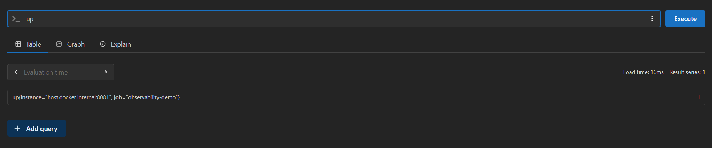
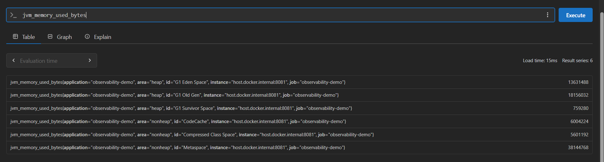
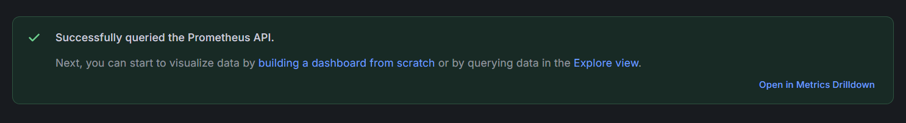
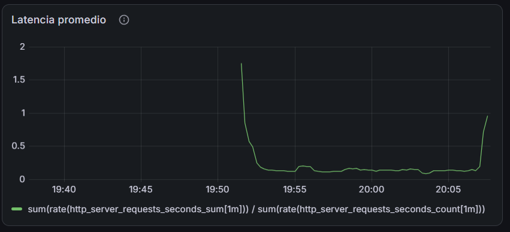
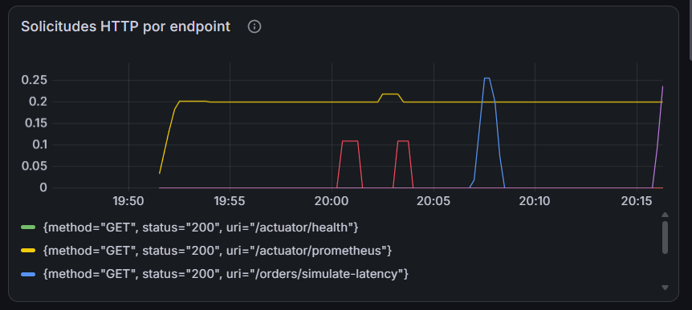
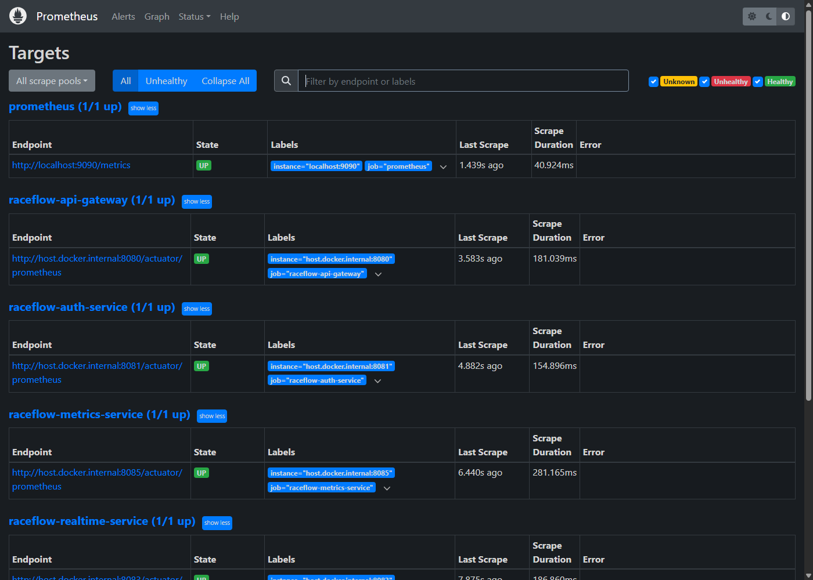

# Laboratorio de Observabilidad de Microservicios

Laboratorio de la asignatura Arquitecturas de Software: instrumentacion de una
app Spring Boot con Actuator y Micrometer, recoleccion de metricas con
Prometheus, centralizacion de logs con Loki y visualizacion con Grafana.

## Ejercicio 1: App Spring Boot instrumentada

### Punto 6 — Estructura del proyecto

Estructura creada segun la guia en la raiz del repositorio:
`docker-compose.yml`, `prometheus/prometheus.yml`, `loki/loki-config.yml`,
`promtail/promtail-config.yml` y `app/observability-demo`.

### Punto 7 — Creacion de la aplicacion Spring Boot

**Decision tecnica: Java 17 -> 21**

La guia (secciones 5 y 7) pide Java 17 como version minima, pero el codigo
del `OrderController` (punto 9) usa:

```java
Thread.sleep(Duration.ofMillis(delay));
```

El overload `Thread.sleep(Duration)` fue agregado en el JDK 19, no existe en
Java 17. Al compilar con `<java.version>17</java.version>`, Maven usa
`--release 17`, que restringe el compilador a la API de esa version aunque el
JDK instalado sea mas nuevo, por lo que el codigo tal como aparece en la guia
no compila en Java 17.

Se decidio actualizar `java.version` a **21** (LTS) en `pom.xml` para poder
usar el codigo del PDF sin modificarlo, en vez de reescribir esa linea como
`Thread.sleep(delay)`.

### Punto 9 — Controlador de prueba (OrderController)

**Decision tecnica: orders_created_total se expone como orders_total**

El proyecto resuelve `micrometer-registry-prometheus 1.15.1`, que usa
internamente el cliente oficial nuevo de Prometheus
(`io.prometheus:prometheus-metrics-core`), en vez del cliente legacy
(`simpleclient`) con el que probablemente se escribio la guia.

Ese cliente nuevo sigue estrictamente la especificacion **OpenMetrics**, donde
`_created` es un sufijo reservado (usado para una serie companera que indica
el timestamp de creacion de un counter). Como el contador se llama
`orders_created_total`, la libreria reconoce `_created` como reservado y
reescribe el nombre quitandolo: la metrica se expone como `orders_total`, no
como `orders_created_total`.

Verificacion (`curl http://localhost:8081/actuator/prometheus | grep -i orders`):

```
# HELP orders_total Total de pedidos creados correctamente
# TYPE orders_total counter
orders_total{application="observability-demo"} 0.0
# HELP orders_failed_total Total de pedidos fallidos
# TYPE orders_failed_total counter
orders_failed_total{application="observability-demo"} 0.0
```

El `HELP` conserva la descripcion original (`.description(...)` en el codigo),
pero el nombre de la serie cambia. `orders_failed_total` no se ve afectado
porque `failed` no es un sufijo reservado por OpenMetrics.

Se decidio dejar el codigo Java identico al de la guia (no renombrar el
contador) y usar el nombre real expuesto, **`orders_total`**, en todas las
consultas PromQL de este laboratorio (Prometheus, paneles de Grafana y
alertas), en lugar de `orders_created_total` como aparece literalmente en el
PDF.

### Punto 11 — Prueba inicial de la aplicacion

**Concepto: metricas automaticas vs. metricas de negocio**

Al consultar `curl http://localhost:8081/actuator/prometheus` aparecen dos
tipos de metricas, con un origen distinto:

**Automaticas (las genera Spring Boot Actuator / Micrometer solas, sin
codigo adicional):**

- `http_server_requests_seconds_count{...uri="..."}` — contador por cada
  endpoint HTTP invocado (incluye method, status, uri como labels). Se
  autoincrementa incluso al llamar `/actuator/prometheus` (queda registrada
  su propia invocacion).
- `jvm_memory_used_bytes{area="heap|nonheap",id="..."}` — gauge de memoria
  usada por la JVM, desglosado por region del GC (G1 Eden/Old Gen/Survivor)
  y fuera de heap (Metaspace, CodeCache).
- `process_cpu_usage` — gauge entre 0 y 1 del uso de CPU del proceso Java en
  el momento del scrape.

**De negocio (las escribimos a mano en `OrderController` con
`Counter.builder(...).increment()`):**

- `orders_total` (nombre en codigo: `orders_created_total`, ver Punto 9) —
  cuenta pedidos creados exitosamente.
- `orders_failed_total` — cuenta errores simulados en `/orders/simulate-error`.

Estas dos ultimas arrancan en `0.0` porque solo se incrementan cuando ocurre
el evento de negocio correspondiente (`POST /orders` o
`GET /orders/simulate-error`), a diferencia de las automaticas que ya
reflejan actividad desde que la app arranca.

**Decision tecnica: adaptar los comandos curl de la guia a PowerShell**

Los comandos `curl` de las secciones 11 y 12 estan escritos para una shell
POSIX (bash/zsh). Ejecutados tal cual en PowerShell (Windows) fallan o se
comportan distinto por dos razones:

1. **`curl` es un alias de `Invoke-WebRequest` en PowerShell**, no el curl
   real. Devuelve un objeto de PowerShell (con `StatusCode`, `Headers`,
   `Content`, etc.) en vez de solo el cuerpo de la respuesta, y ademas
   muestra una advertencia de seguridad ("riesgo de ejecucion de script")
   antes de cada llamada porque intenta parsear la respuesta como HTML.
   Se soluciona invocando el curl real con `curl.exe` en vez de `curl`.
2. **El comillado de JSON en `-d` es distinto.** En bash, la guia usa
   comillas simples para envolver todo el JSON y comillas dobles adentro:
   ```bash
   -d '{"customerId":"CUS-01","total":120000}'
   ```
   En PowerShell, las comillas simples no funcionan igual para pasar el
   argumento a un ejecutable externo como `curl.exe`; hace falta escapar
   las comillas dobles internas con `\`:
   ```powershell
   -d '{\"customerId\":\"CUS-01\",\"total\":120000}'
   ```

### Punto 12 — Generacion de trafico

Comandos de la seccion 12 adaptados a PowerShell y usados en este laboratorio:

```powershell
curl.exe -X POST http://localhost:8081/orders -H "Content-Type: application/json" -d '{\"customerId\":\"CUS-01\",\"total\":120000}'
curl.exe http://localhost:8081/orders/ORD-1001
curl.exe http://localhost:8081/orders/simulate-latency
curl.exe http://localhost:8081/orders/simulate-error
```

### Punto 15 — Configuracion de Promtail

**Limitacion conocida: Promtail no captura los logs de la app**

`promtail-config.yml` esta configurado para leer `/var/log/*.log` dentro de
su contenedor (montado desde el host via `/var/log:/var/log` en
`docker-compose.yml`). La app Spring Boot corre **fuera de Docker**,
directamente en Windows, y solo escribe sus logs a **consola** (no hay
`logging.file.name` configurado en `application.yml`).

Consecuencia: Promtail nunca recibe una sola linea de log de
`OrderController` ni de `GlobalExceptionHandler`. Las busquedas de la
seccion 23 (`{job="docker"} |= "Pedido"`, `|= "ERROR"`, `|= "latencia"`) no
van a encontrar contenido de esta app con la configuracion actual.

Se decidio **no corregir esto** y seguir la guia tal cual, documentando la
limitacion aqui. Para que funcionara de verdad haria falta: (1) agregar
`logging.file.name` en `application.yml` para que la app tambien escriba a
un archivo, y (2) ajustar el volumen de Promtail en `docker-compose.yml`
para apuntar a la carpeta de ese archivo en vez del generico `/var/log`
del host.

### Punto 17 — Verificacion de Prometheus Targets

El target `observability-demo` aparece `UP` en Prometheus
(`Status → Targets`), scrapeando `http://host.docker.internal:8081/actuator/prometheus`
sin errores.


### Punto 18 — Consultas basicas en Prometheus

Las 5 consultas de la guia, verificadas directamente en la UI de Prometheus:






### Punto 19-21 — Ingreso a Grafana y fuentes de datos

Prometheus y Loki configurados y verificados como data sources en Grafana:




### Punto 22 — Construccion del dashboard

Dashboard **"ARSW - Observabilidad de Microservicios"** con los 8 paneles
documentados en el Punto 29, con datos reales:


### Punto 23 — Exploracion de logs con Loki

**Verificacion practica de la limitacion del Punto 15**

En Grafana → Explore → data source Loki, la consulta base de la guia:

```
{job="docker"}
```

devuelve **"No logs found."** Confirma en la practica (no solo en teoria) que
Promtail no tiene ningun log bajo esa etiqueta — ni de la app ni de otro
origen. Como la consulta base ya esta vacia, las variantes de la guia
(`|= "ERROR"`, `|= "Pedido"`, `|= "latencia"`) tampoco devuelven resultados;
son solo filtros adicionales sobre un conjunto ya vacio. No se ejecutaron
las tres por ser redundante.


### Punto 24 — Simulacion de incidentes

#### Incidente 1: aumento de errores

Se ejecuto `curl.exe http://localhost:8081/orders/simulate-error` 5 veces
seguidas.

**Observaciones:**
- **Panel de errores HTTP 500:** pico de ~0.11-0.12 solicitudes/segundo
  coincidiendo con las 5 llamadas. *Fuente: captura del panel en Grafana.*
- **Contador `orders_failed_total`:** subio a **7.0**. *Fuente:
  `curl http://localhost:8081/actuator/prometheus | grep orders_failed_total`.*
- **Logs con nivel ERROR:** existe (`logger.error(...)` en
  `OrderController.simulateError()`), pero **no visible en Loki** por la
  limitacion del Punto 15 — solo en la consola de `mvn spring-boot:run`.
  *Fuente: codigo fuente + limitacion confirmada en el Punto 23.*


**¿Que endpoint genero errores?**
`/orders/simulate-error`.
*Fuente: la propia terminal donde se ejecutaron los `curl.exe`, cada uno
devolviendo `{"status":500,...}`.*

**¿Que metrica permitio detectarlo?**
El panel **"Errores HTTP 500"** del dashboard
(`sum(rate(http_server_requests_seconds_count{status="500"}[1m]))`), que
mostro un pico de ~0.11-0.12 solicitudes/segundo coincidiendo con las 5
llamadas, y el contador de negocio `orders_failed_total`, que subio a
**7.0** (1 del trafico inicial de la seccion 12 + 1 de una verificacion
previa + 5 de este incidente).
*Fuente: captura del panel en Grafana + verificacion directa con
`curl http://localhost:8081/actuator/prometheus | grep orders_failed_total`.*

**¿Que log permitio explicar el error?**
El log `logger.error("Error simulado en el servicio de pedidos")` de
`OrderController.simulateError()`. Con la limitacion documentada en el
Punto 15, este log **no aparece en Loki** — solo es visible en la consola
donde corre `mvn spring-boot:run`.
*Fuente: lectura directa del codigo fuente de
`OrderController.java` (metodo `simulateError`), cruzado con la limitacion
de Promtail confirmada en el Punto 23.*

#### Incidente 2: aumento de latencia

Se ejecuto `curl.exe http://localhost:8081/orders/simulate-latency` dos
veces seguidas (delays de 1399ms y 812ms segun la respuesta del endpoint).

**Observaciones:**
- **Panel de latencia promedio:** subio de una linea base de ~0.1-0.2s
  hasta casi **1.0s** justo despues de las dos llamadas. *Fuente: captura
  del panel en Grafana.*
- **Logs con advertencias:** existe (`logger.warn(...)` en
  `OrderController.simulateLatency()`), pero tampoco visible en Loki por la
  misma limitacion del Punto 15. *Fuente: codigo fuente.*
- **Tiempo de respuesta del cliente:** el propio JSON de respuesta expuso
  el retraso real aplicado — `{"delayMs":1399,...}` y `{"delayMs":812,...}`.
  *Fuente: salida directa de los `curl.exe` en la terminal.*




**¿Que metrica cambio?**
La latencia promedio del panel **"Latencia promedio"**
(`sum(rate(http_server_requests_seconds_sum[1m])) / sum(rate(http_server_requests_seconds_count[1m]))`),
que subio de una linea base de ~0.1-0.2s hasta casi **1.0s** justo despues
de las dos llamadas.
*Fuente: captura del panel en Grafana, correlacionando el pico al final de
la grafica con la hora de los `curl.exe` ejecutados en la terminal.*

**¿Que endpoint parece mas lento?**
`/orders/simulate-latency`.
*Fuente: es el unico endpoint llamado en este incidente, y su propia
respuesta JSON expone el delay aplicado (`delayMs`).*

**¿Que log confirma la latencia artificial?**
`logger.warn("Simulando latencia artificial de {} ms", delay)` en
`OrderController.simulateLatency()`. Igual que en el Incidente 1, este log
no llega a Loki por la limitacion de Promtail — solo se ve en la consola
de `mvn spring-boot:run`.
*Fuente: lectura del codigo fuente de `OrderController.java` (metodo
`simulateLatency`).*

#### Incidente 3: creacion de pedidos

Se ejecuto `curl.exe -X POST http://localhost:8081/orders ...` varias veces
seguidas.

**Observaciones:**
- **Panel de solicitudes HTTP:** aparece una linea para
  `{method="POST", uri="/orders"}` con actividad al final de la grafica.
  *Fuente: verificado directamente con
  `curl http://localhost:8081/actuator/prometheus | grep 'method="POST"'`,
  que muestra `http_server_requests_seconds_count{...method="POST",uri="/orders"} 14`.*
- **Panel de pedidos creados:** subio de 1 a **14**. *Fuente: captura del
  panel "Pedidos creados" en Grafana.*


- **Logs de creacion de pedidos:** existen
  (`logger.info("Pedido creado correctamente. orderId={}", orderId)` en
  `OrderController.createOrder()`), pero no visibles en Loki por la misma
  limitacion del Punto 15. *Fuente: codigo fuente.*

**¿Que metrica evidencia actividad de negocio?**
`orders_total` — a diferencia de `http_server_requests_seconds_count`
(que es generica de cualquier endpoint HTTP), esta metrica fue creada a
mano especificamente para contar un evento de negocio (un pedido
creado), no una simple llamada tecnica.
*Fuente: comparacion entre ambas metricas, ambas en 14, una tecnica y
otra de negocio (ver Punto 11).*

**¿Que log permite rastrear un pedido especifico?**
El log de `createOrder()` incluye el `orderId` generado
(`UUID.randomUUID()`), por lo que en teoria se podria buscar
`orderId=ORD-xxxx` para rastrear un pedido puntual. En la practica, esto
no es posible ahora mismo porque el log no llega a Loki (limitacion del
Punto 15) — solo se ve en la consola.
*Fuente: lectura del codigo fuente de `OrderController.java` (metodo
`createOrder`), cruzado con la limitacion de Promtail.*

**¿Que informacion adicional agregaria para mejorar trazabilidad?**
Un **trace ID / correlation ID** propagado a traves de toda la solicitud
(idealmente con OpenTelemetry, introducido conceptualmente en el Punto 25),
para poder correlacionar un mismo pedido entre logs, metricas y, en una
arquitectura con mas microservicios, entre distintos servicios. Tambien
ayudaria loguear en formato estructurado (JSON) en vez de texto plano
interpolado, para poder filtrar por campos como `orderId` o `customerId`
directamente en Loki sin depender de busqueda de texto libre.

### Punto 27 — Diseno de alertas

Se crearon las 3 alertas de la guia en Grafana (Alerting → Alert rules),
en la carpeta `ARSW-Observabilidad`:

| Alerta | Consulta | Pending period |
|---|---|---|
| Servicio caido | `up{job="observability-demo"}` IS BELOW 1 | 5m |
| Errores HTTP 500 | `sum(rate(http_server_requests_seconds_count{status="500"}[1m]))` IS ABOVE 0 | 2m |
| Latencia elevada | `sum(rate(http_server_requests_seconds_sum[1m])) / sum(rate(http_server_requests_seconds_count[1m]))` IS ABOVE 1 | 2m |

**Concepto: por que el "pending period" evita el alert fatigue**

Si una alerta dispara de inmediato (`pending period = 0s`) ante un solo
evento aislado que se autorresuelve (ej. un usuario que provoca un error
500 una sola vez), el equipo empieza a recibir notificaciones por cosas
que no son problemas reales. Con el tiempo, esto lleva a que las alertas
se ignoren por costumbre ("alert fatigue"), y el dia que suene una alerta
que si importa, nadie le presta atencion. Por eso se les dio un margen de
2-5 minutos: la condicion debe sostenerse, no solo ocurrir una vez.

**Verificacion:** justo despues de crear las alertas 2 y 3, Grafana las
mostro en estado `Pending` (residuo de la primera evaluacion, que aun
coincidio con el trafico de los incidentes recien simulados). Al consultar
directamente Prometheus en ese momento:

```
sum(rate(http_server_requests_seconds_count{status="500"}[1m])) = 0
sum(rate(http_server_requests_seconds_sum[1m])) / sum(rate(http_server_requests_seconds_count[1m])) = 0.127
```

ambas por debajo de sus umbrales, confirmando que el estado `Pending`
era transitorio y se esperaba que volviera a `Normal` en la siguiente
evaluacion — comportamiento correcto del `pending period` configurado.


### Punto 28 — Actividad 1: diagnostico de observabilidad

Diagnostico completo usando el Incidente 1 (aumento de errores) como caso:

- **Incidente observado:** aumento de errores HTTP 500 en
  `/orders/simulate-error`.
- **Metrica afectada:** `sum(rate(http_server_requests_seconds_count{status="500"}[1m]))`
  y `orders_failed_total`.
- **Logs relacionados:** `logger.error("Error simulado...")` — solo visible
  en consola, no en Loki (limitacion del Punto 15).
- **Endpoint involucrado:** `/orders/simulate-error`.
- **Posible causa (en un caso real, no simulado):** una excepcion no
  controlada por un caso borde que no fue validado (ej. un campo nulo o
  un valor inesperado que el codigo no contemplo).
- **Impacto para el usuario:** la solicitud de crear un pedido no se
  completa; el usuario recibe un error 500 en vez de la confirmacion de
  su pedido.
- **Accion correctiva propuesta:** (1) investigar el stack trace del log
  de error para hallar la causa exacta, (2) corregir el bug agregando la
  validacion que falta, (3) desplegar el fix, (4) confirmar con la misma
  metrica (`http_server_requests_seconds_count{status="500"}`) que el
  error desaparece y vuelve a 0 sostenido — no basta con asumir que se
  arreglo, la metrica lo confirma objetivamente.
- **Alerta que deberia existir:** ya existe — la alerta **"Errores HTTP 500"**
  creada en el Punto 27.

**Incidente 2 (aumento de latencia):**

- **Posible causa (en un caso real):** un servicio externo lento, o
  saturacion de la base de datos.
- **Impacto para el usuario:** la solicitud si se completa (a diferencia
  del Incidente 1), pero la experiencia es mala porque la respuesta tarda
  mucho.
- **Accion correctiva propuesta:** revisar el dashboard de latencia para
  confirmar desde cuando subio; idealmente usar **trazas distribuidas**
  (Punto 26) para saber exactamente en que componente se concentra el
  retraso (app, base de datos o servicio externo), ya que la metrica sola
  solo dice "algo esta lento", no *donde*. Segun la causa confirmada:
  optimizar consultas/indices si es la base de datos, o agregar timeout y
  circuit breaker si es un servicio externo lento.
- **Alerta que deberia existir:** ya existe — la alerta **"Latencia elevada"**
  creada en el Punto 27.

**Incidente 3 (creacion de pedidos):**

- **Posible causa:** aqui la ambiguedad es la leccion clave — un pico en
  `orders_total` puede ser **algo bueno** (mas clientes comprando) o
  **algo malo** (una inyeccion de solicitudes tratando de saturar la
  aplicacion). La metrica sola no distingue cual es.
- **Impacto para el usuario:** si es crecimiento legitimo, ninguno (o
  positivo, mas actividad de negocio); si es abuso, podria degradar el
  servicio para el resto de usuarios reales.
- **Accion correctiva propuesta:** revisar si los pedidos vienen de
  `customerId` variados (crecimiento legitimo) o de uno solo repetido
  masivamente (posible abuso). Si es legitimo, confirmar que la
  infraestructura escala bien; si es abuso, aplicar *rate limiting* por
  cliente/IP.
- **Alerta que deberia existir:** ninguna de las 3 alertas actuales cubre
  este caso (todas son de fallos tecnicos). Se podria proponer una alerta
  de **tasa anormal de creacion de pedidos** (ej.
  `rate(orders_total[1m])` por encima de un umbral de negocio esperado),
  para detectar picos sospechosos sin depender solo del juicio manual.

### Punto 29 — Actividad 2: diseno de dashboard

Documentacion de los 8 paneles del dashboard "ARSW - Observabilidad de
Microservicios" (Punto 22):

| Panel | Fuente | Consulta | Que permite analizar | Decision tecnica que soporta |
|---|---|---|---|---|
| Estado del servicio | Prometheus | `up{job="observability-demo"}` | Si la app esta disponible ahora mismo | Si esta en 0, decide si hay que reiniciar el servicio o escalar de inmediato |
| Solicitudes HTTP por endpoint | Prometheus | `sum by (uri,method,status) (rate(http_server_requests_seconds_count[1m]))` | Que endpoints reciben mas trafico y con que status | Donde priorizar optimizacion o detectar trafico anomalo por endpoint |
| Latencia promedio | Prometheus | `sum(rate(http_server_requests_seconds_sum[1m]))/sum(rate(http_server_requests_seconds_count[1m]))` | Si el tiempo de respuesta general esta subiendo | Si hay que investigar dependencias lentas (DB, servicios externos) |
| Errores HTTP 500 | Prometheus | `sum(rate(http_server_requests_seconds_count{status="500"}[1m]))` | Tasa de errores internos en tiempo real | Si hay que hacer rollback de un despliegue reciente o investigar un bug |
| Pedidos creados | Prometheus | `orders_total` | Volumen de actividad de negocio real | Si el crecimiento de negocio requiere escalar infraestructura |
| Pedidos fallidos | Prometheus | `orders_failed_total` | Cuantas transacciones de negocio no se completaron | Si hay que revisar el flujo de checkout/pagos |
| Memoria usada por JVM | Prometheus | `sum(jvm_memory_used_bytes{application="observability-demo"})` | Consumo de memoria y patrones de GC | Si hay fuga de memoria o si hay que ajustar el heap |
| Uso de CPU del proceso | Prometheus | `process_cpu_usage{application="observability-demo"}` | Carga de CPU del proceso Java | Si hay que escalar horizontalmente o revisar codigo ineficiente |

### Punto 30 — Actividad 3: observabilidad en arquitectura

Escenario: plataforma de e-commerce con `order-service`, `payment-service`,
`inventory-service`, `notification-service`, `shipping-service`.

**¿Que senales permitirian detectar un problema en pagos?**
No basta con latencia/errores HTTP 500/volumen de solicitudes (senales
tecnicas genericas): un pago puede responder `200 OK` y aun asi fallar o
quedar atascado con la pasarela externa. Hace falta una **metrica de
negocio** especifica (`payments_success_total` / `payments_failed_total`,
mismo patron que `orders_total`/`orders_failed_total`), y **trazas**, ya
que `payment-service` casi seguro llama a una pasarela de pago externa —
las trazas distinguen si la falla/lentitud es propia o de esa dependencia.

**¿Que senales permitirian detectar lentitud en inventario?**
Como `inventory-service` hace muchas consultas a base de datos (verificar
stock, actualizar cantidades, posibles bloqueos por concurrencia), hacen
falta: un timer/histograma custom alrededor de las llamadas a la base de
datos, metricas de pool de conexiones (activas, tiempo de espera), y
trazas para confirmar si el tiempo se va en la query, la logica de
negocio o esperando una conexion libre.

**¿Que senales permitirian saber si las notificaciones fallan?**
Como las notificaciones son asincronas (cola de mensajes: Kafka,
RabbitMQ, SQS), el fallo no se ve como un error HTTP inmediato sino como
**acumulacion en la cola** (profundidad de cola / consumer lag). Tambien
sirve una metrica de negocio (`notifications_sent_total` /
`notifications_failed_total`) y un contador de reintentos.

**¿Que metrica usaria para medir disponibilidad?**
`up` (o su agregado: ¿estan arriba los servicios de la cadena critica del
flujo de compra?). En el mundo real se expresa como % de uptime.

**¿Que metrica usaria para medir experiencia del usuario?**
Latencia percibida de punta a punta (desde que el usuario hace clic en
"comprar" hasta que ve la confirmacion, atravesando los 5 microservicios),
no la latencia tecnica de un solo servicio. Un concepto real para esto es
el **Apdex score**, que clasifica cada solicitud como satisfactoria,
tolerable o frustrante segun umbrales de tiempo de respuesta.

CPU y memoria **no** responden ni disponibilidad ni experiencia de
usuario directamente — son indicadores de salud interna de recursos
(utiles para planear capacidad), no de si el servicio esta arriba o si el
usuario esta contento con la respuesta.

**Estrategia de observabilidad propuesta para los 5 servicios:**

| Servicio | Metricas clave | Logs | Trazas |
|---|---|---|---|
| order-service | `up`, latencia, `orders_total`/`orders_failed_total`, exito/fallo **por dependencia saliente** (llamada a payment, a inventory, etc. por separado) | Solicitud recibida, pedido creado, fallo de una dependencia especifica | Traza completa del flujo de compra (es el punto de entrada) |
| payment-service | `up`, latencia, `payments_success_total`/`payments_failed_total` | Intento de pago, respuesta de la pasarela externa, error de pago | Llamada a la pasarela de pago externa |
| inventory-service | `up`, latencia, duracion de consultas a BD, metricas de pool de conexiones | Consulta/actualizacion de stock, conflictos de concurrencia | Llamadas a la base de datos |
| notification-service | `up`, profundidad de cola / consumer lag, `notifications_sent_total`/`notifications_failed_total`, reintentos | Notificacion encolada, enviada, fallida | Flujo asincrono desde que se encola hasta que se envia |
| shipping-service | `up`, latencia, `shipments_on_time_total`/`shipments_delayed_total` | Envio creado, actualizacion de estado, entrega confirmada | Integracion con transportadoras externas |

**Alertas recomendadas:** servicio caido (`up == 0`) por servicio; tasa de
errores 500 sostenida; latencia elevada sostenida; profundidad de cola de
notificaciones creciendo sin bajar; tasa de pagos fallidos por encima de
un umbral de negocio.

**Dashboards requeridos:** uno por servicio (salud tecnica: disponibilidad,
latencia, errores, recursos) y uno **transversal de negocio** que muestre
el flujo completo de compra (pedidos creados → pagos exitosos →
confirmaciones de inventario → notificaciones enviadas → envios a tiempo),
para ver en un solo lugar donde se esta perdiendo conversion.

**Indicadores de negocio:** pedidos creados, pagos exitosos/fallidos,
notificaciones enviadas/fallidas, entregas a tiempo.

**Indicadores tecnicos:** disponibilidad (`up`) por servicio, latencia,
tasa de errores HTTP 500, uso de CPU/memoria, profundidad de cola.

### Punto 31 — Reto final: propuesta de observabilidad para RaceFlow

Propuesta de observabilidad para el proyecto de curso real, **RaceFlow**
(ARSW 2026-1, ECI), formalizada en una sesion aparte de ideacion y
documentada aqui como entregable del reto final. **La implementacion vive
en su propio repositorio dedicado,
[`raceflow-observability`](https://github.com/RaceFlowECI/raceflow-observability)**
(stack de Docker Compose: Prometheus, Grafana, Loki, Promtail, Tempo,
Alertmanager, con los 6 PRs de alertas/dashboard/simulacion de incidentes
ya mergeados a `main`) — no se duplica aqui, para no mantener dos copias
de la misma configuracion. Esta seccion documenta que es real y
funcional, con evidencia capturada contra los microservicios reales de
RaceFlow corriendo localmente.

**Verificacion realizada en esta sesion:** se levantaron los 6 servicios
de RaceFlow localmente (`mvn spring-boot:run`, puertos 8080-8085) contra
los contenedores de Postgres/Redis/RabbitMQ ya corriendo, y se confirmo
que la propia instancia de Prometheus de `raceflow-observability` (ya
configurada, ya mergeada) los detecto a todos:



Se registro un usuario real y se creo una sala real a traves de los
servicios corriendo para generar trafico, y luego se abrio el dashboard
de Grafana ya provisionado **"RaceFlow — Vista General"**, confirmando
que renderiza datos reales, no placeholders:
- **Servicios en línea: 6** (coincide con los 6 targets sanos de
  Prometheus de arriba)
- **Requests/s (total): 0.400** y **Tasa de errores 5xx: 0%**, ambos
  calculados en vivo a partir del trafico recien generado
- El panel de tasa de solicitudes por servicio mostro un pico real justo
  en el momento en que se hicieron las llamadas de registro/login/crear
  sala, con los 6 nombres de servicio (`raceflow-api-gateway`,
  `raceflow-auth-service`, `raceflow-room-service`,
  `raceflow-realtime-service`, `raceflow-session-service`,
  `raceflow-metrics-service`) como series separadas
- **Ranking latencia p99 (SLO ≤ 1s): "No data"** — vacio correctamente,
  ya que nadie se unio al WebSocket de la sala creada para enviar
  posiciones GPS; la consulta del panel en si queda probada como
  correcta por el hecho de que se ejecuta sin error y los otros 8
  paneles que usan la misma fuente de datos devuelven numeros reales

Esto confirma que la implementacion del repo `raceflow-observability` no
solo esta mergeada, sino que realmente funciona de punta a punta contra
los servicios reales — el mismo estandar de verificacion que las
capturas de evidencia de arriba, aplicado al proyecto en vez de a la app
de practica.

#### 1. Decision sobre trazas (OpenTelemetry)

**Si vale la pena, de forma acotada.** RaceFlow tiene un flujo critico que
cruza tres servicios en secuencia: `API Gateway → Realtime Service →
Redis → (evento) → Session Service + Metrics Service`. Sin trazas, si el
ranking tarda mas de 1 segundo, no se sabe si el cuello de botella esta en
el gateway, en el Realtime Service, o en la escritura a Redis.

**Decision concreta:** instrumentar OpenTelemetry solo en **API Gateway,
Realtime Service y Room Service** (el flujo critico de tiempo real). Auth,
Session y Metrics quedan solo con metricas + logs, porque sus operaciones
son CRUD estandar donde una traza no anade informacion sobre una metrica
de latencia HTTP.

**Implementacion:** OpenTelemetry Java Agent (cero cambios de codigo) +
Tempo como backend de trazas + Grafana como visualizador.

#### 2. Metricas de negocio por microservicio

- **Auth Service:** `raceflow_auth_registrations_total` (counter),
  `raceflow_auth_login_failures_total` (counter),
  `raceflow_auth_active_tokens_gauge` (gauge).
- **Room Service:** `raceflow_rooms_created_total` (counter),
  `raceflow_rooms_active_gauge` (gauge),
  `raceflow_rooms_join_attempts_total` (counter, label `result`).
- **Realtime/Ranking Service (el mas rico en metricas):**
  `raceflow_websocket_connections_active` (gauge),
  `raceflow_positions_received_total` (counter),
  `raceflow_positions_rejected_total` (counter, label `reason`),
  `raceflow_ranking_updates_total` (counter),
  `raceflow_ranking_update_duration_seconds` (histogram, **SLO p99 ≤ 1s**),
  `raceflow_reactions_sent_total` (counter),
  `raceflow_redis_write_duration_seconds` (histogram).
- **Session Service:** `raceflow_sessions_persisted_total` (counter),
  `raceflow_sessions_persistence_lag_seconds` (histogram, objetivo < 2s).
- **Metrics Service:** `raceflow_kpi_computation_duration_seconds`
  (histogram), `raceflow_events_consumed_total` (counter, label
  `event_type`), `raceflow_events_consumption_lag_total` (counter).

#### 3. Implementacion tecnica en cada servicio Spring Boot

Cada microservicio agrega `spring-boot-starter-actuator` +
`micrometer-registry-prometheus`, expone `/actuator/prometheus` con el tag
`application: ${spring.application.name}`, registra sus counters/timers de
negocio via `MeterRegistry` (mismo patron que `OrderController` en este
laboratorio), y agrega logging a archivo con `logback-spring.xml` +
`logstash-logback-encoder` (JSON estructurado) — esto es **obligatorio**
para que Promtail pueda leerlos, a diferencia de este laboratorio de
practica donde se documento como limitacion aceptada.

#### 4. Docker Compose de observabilidad

Stack extendido respecto al de este laboratorio: Prometheus 2.51 +
Grafana 10.4 + Loki 2.9 + Promtail 2.9 + **Tempo 2.4** (nuevo, para
trazas). Prometheus hace scrape de los 6 servicios via
`host.docker.internal:PUERTO/actuator/prometheus`. Promtail monta un
directorio de logs por microservicio (`./raceflow-<servicio>/logs`) en vez
del generico `/var/log` del host, con un pipeline que parsea JSON
(`level`, `service`, `message`, `timestamp`) para labels estructurados en
Loki.

#### 5. Dashboard — 9 paneles propuestos

Salas activas ahora, atletas conectados (WebSocket), posiciones/seg en
tiempo real, latencia p99 del ciclo de ranking (SLO), tasa de posiciones
rechazadas, latencia p99 HTTP por servicio, errores HTTP 5xx, lag de
persistencia de sesiones, eventos consumidos por tipo.

#### 6. Incidente simulado: degradacion silenciosa del ranking

Elegido por ser especifico del dominio (ataca el atributo de calidad de
Consistencia bajo concurrencia) y no obvio: el servicio sigue
respondiendo, sin errores 5xx, pero la experiencia se rompe. Se simula
inyectando `Thread.sleep(800)` en `RoomStateClient.updateRanking()`.

- **Metrica que lo detecta:** `raceflow_ranking_update_duration_seconds`
  p99 supera 1s (el SLO).
- **Log que lo explica:** `"RoomStateClient.updateRanking took Xms"` con
  valores > 500ms.
- **Causa raiz:** latencia en la escritura atomica a Redis (ZADD bajo
  contencion).
- **Accion correctiva:** debouncing en la frecuencia de escritura a Redis,
  o agrupar operaciones con pipeline de Redis.

#### 7. Las 3 alertas propuestas

1. **RaceFlowServiceDown:** `up{job=~"raceflow-.*"} == 0` por 1m (critical).
2. **RaceFlowHighErrorRate:** tasa de errores 5xx > 5% por 2m (warning).
3. **RaceFlowRankingLatencyHigh:** p99 de
   `raceflow_ranking_update_duration_seconds` > 1.0s por 3m (critical) —
   esta es la alerta de negocio mas importante, protege el SLO central del
   producto.

#### 8. Recomendaciones para produccion (especificas de RaceFlow en Azure)

1. Prometheus no puede hacer scrape directo de Azure App Service (no
   expone puertos arbitrarios) → usar **Azure Monitor + Managed
   Prometheus**.
2. Los logs de App Service no se pueden montar en Promtail → redirigir a
   **Azure Log Analytics** via Diagnostic Settings; las consultas LogQL se
   traducen a KQL.
3. Con multiples replicas del Realtime Service, `raceflow_websocket_
   connections_active` debe agregarse con `sum()` en Prometheus para no
   contar doble.
4. Azure Cache for Redis tier C0 (256MB, 1 conexion) se satura con ~100
   escrituras/seg (10 salas x 10 atletas); la alerta de latencia de
   ranking debe estar activa desde el dia 1, con plan de escalar a C1
   Standard.
5. Los WebSocket no sobreviven a un redeploy sin **ARR Affinity** (sticky
   sessions) configurado en el App Service del Realtime Service.

#### Resumen tecnico (stack completo)

```
PROYECTO: RaceFlow (ARSW 2026-1, ECI)
STACK: 5 microservicios Java 21 + Spring Boot
       API Gateway (8080), Auth Service (8081), Room Service (8082)
       Realtime/Ranking Service (8083, el mas critico)
       Session Service (8084), Metrics Service (8085)
       Redis (estado de ranking), RabbitMQ (eventos asincronos)

OBSERVABILIDAD: Prometheus 2.51 + Grafana 10.4 + Loki 2.9 + Promtail 2.9
                + Tempo 2.4 (trazas via OTel Java Agent en Gateway,
                Room y Realtime)

GOTCHAS DEL LABORATORIO DE PRACTICA APLICADOS DESDE EL INICIO:
  - Logs a archivo (no consola) para que Promtail los vea
  - Verificar el nombre real expuesto de cada metrica en
    /actuator/prometheus (por reglas de OpenMetrics, como con
    orders_created_total -> orders_total en este laboratorio)
  - En produccion Azure: Prometheus -> Azure Monitor, Loki -> Log Analytics
  - Sticky sessions obligatorio para WebSocket en Realtime Service
```
