# Microservices Observability Lab

Software Architecture course lab: instrumenting a Spring Boot app with
Actuator and Micrometer, collecting metrics with Prometheus, centralizing
logs with Loki, and visualizing everything with Grafana.

## Exercise 1: Instrumented Spring Boot App

### Project setup

Structure created at the repo root: `docker-compose.yml`,
`prometheus/prometheus.yml`, `loki/loki-config.yml`,
`promtail/promtail-config.yml`, and `app/observability-demo`.

**Decision — Java 17 → 21.** The guide asks for Java 17, but
`OrderController` uses `Thread.sleep(Duration.ofMillis(delay))`, an
overload added in JDK 19. Compiling with `--release 17` hides that API
even on a newer JDK, so the code as written in the guide won't build on
17. `java.version` was bumped to **21** (LTS) instead of rewriting that
line, to keep the code identical to the source PDF.

### Order metrics and the OpenMetrics naming gotcha

The project resolves `micrometer-registry-prometheus 1.15.1`, which uses
the new official Prometheus client (`io.prometheus:prometheus-metrics-core`)
instead of the legacy `simpleclient` the guide was likely written against.
That new client follows the **OpenMetrics** spec strictly, where
`_created` is a reserved suffix (used for a companion series marking a
counter's creation timestamp). Since the counter is named
`orders_created_total`, the library strips `_created` and exposes it as
**`orders_total`** instead — verified with
`curl http://localhost:8081/actuator/prometheus | grep -i orders`.
`orders_failed_total` is unaffected since `failed` isn't a reserved word.
The Java code was left identical to the guide; every PromQL query in this
lab uses the real exposed name, `orders_total`.

**Automatic vs. business metrics** (seen via `/actuator/prometheus`):

| Type | Examples | Source |
|---|---|---|
| Automatic | `http_server_requests_seconds_count`, `jvm_memory_used_bytes`, `process_cpu_usage` | Generated by Actuator/Micrometer with zero extra code |
| Business | `orders_total`, `orders_failed_total` | Hand-instrumented in `OrderController` via `Counter.builder(...).increment()` |

The business counters start at `0.0` and only move on the matching
business event (`POST /orders`, `GET /orders/simulate-error`), unlike the
automatic ones which already reflect activity as soon as the app starts.

**Adapting the guide's curl commands to PowerShell.** Two adjustments were
needed: (1) `curl` is a PowerShell alias for `Invoke-WebRequest`, which
returns a PowerShell object instead of the raw body and prompts a
security warning before every call — solved by using `curl.exe` instead;
(2) JSON quoting in `-d` differs — bash's `-d '{"a":"b"}'` becomes
`-d '{\"a\":\"b\"}'` in PowerShell.

Traffic commands used in this lab:

```powershell
curl.exe -X POST http://localhost:8081/orders -H "Content-Type: application/json" -d '{\"customerId\":\"CUS-01\",\"total\":120000}'
curl.exe http://localhost:8081/orders/ORD-1001
curl.exe http://localhost:8081/orders/simulate-latency
curl.exe http://localhost:8081/orders/simulate-error
```

### Known limitation — Promtail never sees the app's logs

`promtail-config.yml` reads `/var/log/*.log` inside its own container
(mounted from the host). The Spring Boot app runs **outside Docker**,
directly on Windows, and only logs to **console** — there is no
`logging.file.name` in `application.yml`. As a result, Promtail never
receives a single line from `OrderController` or
`GlobalExceptionHandler`. This was deliberately **not fixed** (kept as
close to the guide as possible) and is confirmed in practice below: a
base query of `{job="docker"}` in Grafana Explore returns **"No logs
found."** A real fix would require (1) file logging in the app and (2) a
Promtail volume mount pointed at that file's folder instead of the
generic host `/var/log`.

## Verification evidence

Prometheus target `observability-demo` is `UP`, scraping
`http://host.docker.internal:8081/actuator/prometheus` without errors:

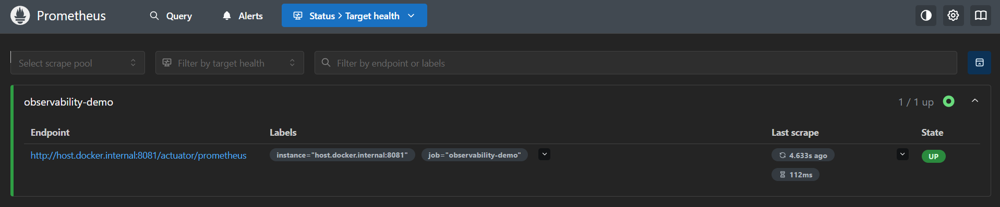

The 5 basic PromQL queries from the guide, run directly in Prometheus:


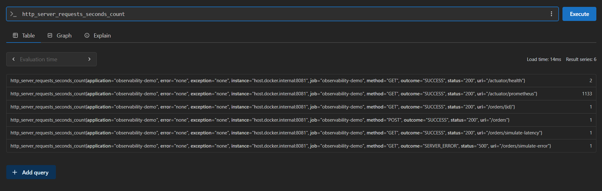

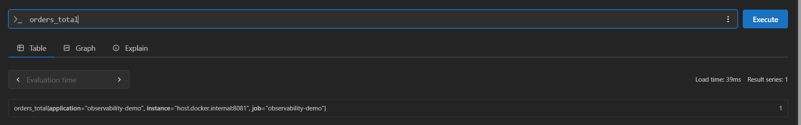
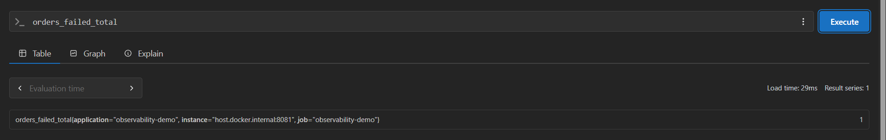

Prometheus and Loki configured and verified as Grafana data sources:


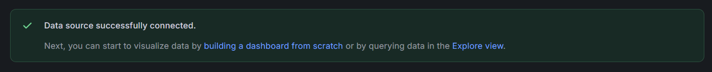

Dashboard **"ARSW - Observabilidad de Microservicios"** with all 8 panels
(see table below) and real data:

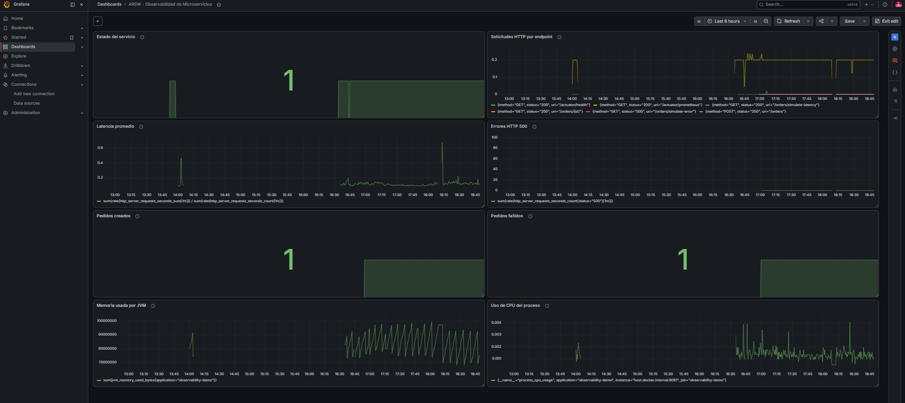

Practical confirmation of the Promtail limitation — `{job="docker"}` in
Grafana Explore returns no results:

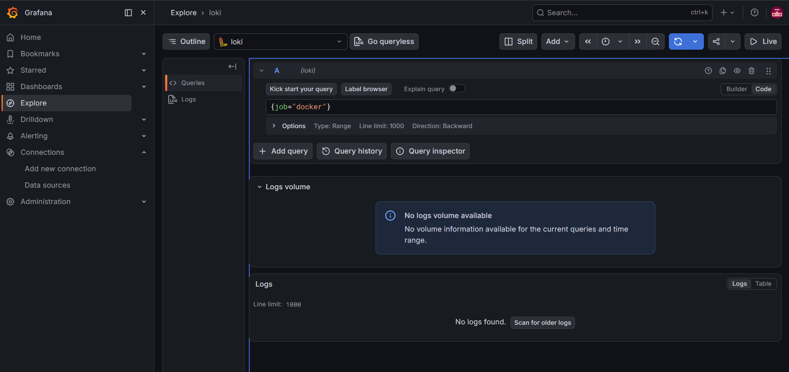

## Simulated incidents

Three incidents were triggered against the running app and traced through
metrics, dashboard panels, and (where applicable) source code, since logs
never reach Loki (see limitation above).

| Incident | Trigger | Metric that detected it | Log that explains it (console only) | Real-world root cause | User impact | Corrective action | Alert that should exist |
|---|---|---|---|---|---|---|---|
| 1. Error spike | 5× `GET /orders/simulate-error` | `orders_failed_total` → 7.0; `sum(rate(http_server_requests_seconds_count{status="500"}[1m]))` spiked to ~0.11-0.12 | `logger.error("Error simulado en el servicio de pedidos")` in `simulateError()` | An unhandled exception from an unvalidated edge case | Order creation request fails outright | Investigate the stack trace → fix the missing validation → deploy → confirm the 500-rate metric returns to a sustained 0 | Already exists: **HTTP 500 errors** |
| 2. Latency spike | 2× `GET /orders/simulate-latency` (delays 1399ms, 812ms) | "Average latency" panel rose from a ~0.1-0.2s baseline to almost 1.0s | `logger.warn("Simulando latencia artificial de {} ms", delay)` in `simulateLatency()` | A slow external dependency or database saturation | Request still completes, but the response is slow | Check the latency dashboard; ideally use distributed tracing to pinpoint *where* the delay is (app, DB, external call), since the metric alone can't say where | Already exists: **Elevated latency** |
| 3. Order creation spike | Several `POST /orders` | `orders_total` rose from 1 to 14; `http_server_requests_seconds_count{method="POST",uri="/orders"}` also at 14 | `logger.info("Pedido creado correctamente. orderId={}", orderId)` in `createOrder()` | Ambiguous by design — could be genuine business growth **or** an abuse/flood pattern | None if legitimate; could degrade service for real users if abuse | Check whether orders come from varied `customerId`s (legitimate) or one repeated heavily (abuse); scale infra or apply rate limiting accordingly | None of the 3 current alerts cover this (all are technical failures) — propose an **abnormal order-creation rate** alert |

Evidence:

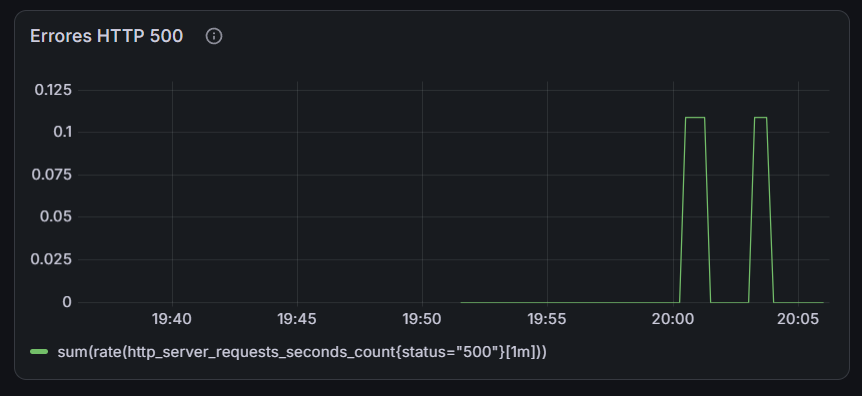


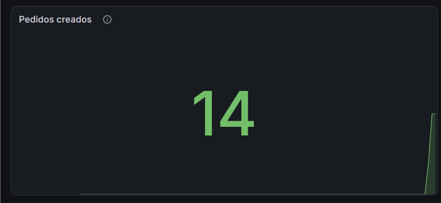

Traceability note (incident 3): the `createOrder()` log includes the
generated `orderId`, so in principle a specific order could be traced by
searching `orderId=ORD-xxxx` — but not in practice today, since the log
never reaches Loki. What would genuinely improve traceability is a
**trace/correlation ID** propagated across the whole request (ideally via
OpenTelemetry) plus structured (JSON) logging instead of interpolated
plain text, so fields like `orderId` or `customerId` become filterable
directly in Loki.

## Alerts

Three Grafana alert rules created under folder `ARSW-Observabilidad`:

| Alert | Query | Pending period |
|---|---|---|
| Service down | `up{job="observability-demo"}` IS BELOW 1 | 5m |
| HTTP 500 errors | `sum(rate(http_server_requests_seconds_count{status="500"}[1m]))` IS ABOVE 0 | 2m |
| Elevated latency | `sum(rate(http_server_requests_seconds_sum[1m])) / sum(rate(http_server_requests_seconds_count[1m]))` IS ABOVE 1 | 2m |

**Why the pending period matters.** Firing instantly on a single isolated
event that self-resolves (e.g., one user hitting one 500) trains the team
to ignore alerts ("alert fatigue") — so each alert waits 2-5 minutes of
sustained breach before firing, not a single sample.

Right after creation, alerts 2 and 3 briefly showed `Pending` — a
leftover from their first evaluation, which still overlapped with the
just-simulated incidents. Querying Prometheus directly at that moment
confirmed both conditions were already back below threshold
(`errors=0`, `latency=0.127`), so the state was transient and expected to
settle to `Normal` — correct behavior for the configured pending period.

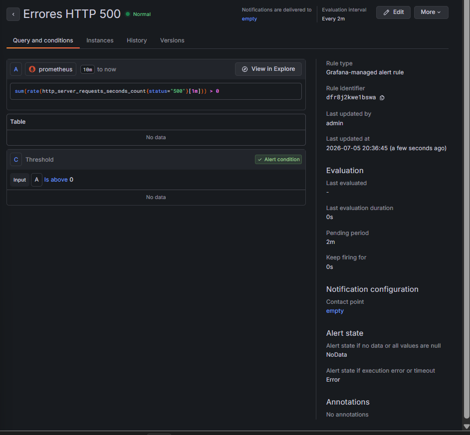
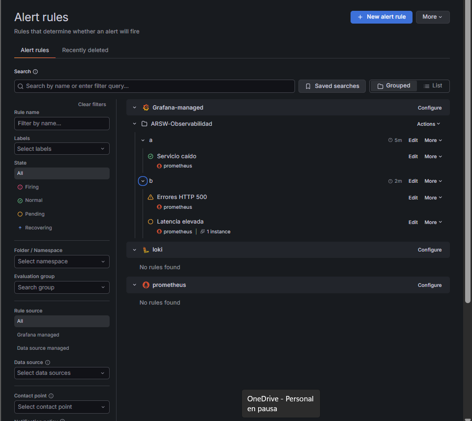

## Dashboard design

| Panel | Source | Query | What it shows | Decision it supports |
|---|---|---|---|---|
| Service status | Prometheus | `up{job="observability-demo"}` | Whether the app is up right now | Restart/scale immediately if at 0 |
| HTTP requests per endpoint | Prometheus | `sum by (uri,method,status) (rate(http_server_requests_seconds_count[1m]))` | Which endpoints get the most traffic and with what status | Where to prioritize optimization or spot abnormal traffic |
| Average latency | Prometheus | `sum(rate(http_server_requests_seconds_sum[1m]))/sum(rate(http_server_requests_seconds_count[1m]))` | Whether overall response time is rising | Whether to investigate slow dependencies |
| HTTP 500 errors | Prometheus | `sum(rate(http_server_requests_seconds_count{status="500"}[1m]))` | Real-time internal error rate | Whether to roll back a deploy or investigate a bug |
| Orders created | Prometheus | `orders_total` | Real business activity volume | Whether growth requires scaling infra |
| Orders failed | Prometheus | `orders_failed_total` | How many business transactions didn't complete | Whether to review the checkout/payment flow |
| JVM memory used | Prometheus | `sum(jvm_memory_used_bytes{application="observability-demo"})` | Memory consumption and GC pattern | Whether there's a leak or the heap needs tuning |
| Process CPU usage | Prometheus | `process_cpu_usage{application="observability-demo"}` | Java process CPU load | Whether to scale out or review inefficient code |

## Observability at the architecture level

Scenario: e-commerce platform with `order-service`, `payment-service`,
`inventory-service`, `notification-service`, `shipping-service`.

- **Detecting a payment problem:** generic signals (latency/500s/volume)
  aren't enough — a payment can return `200 OK` and still fail or hang
  with the external gateway. Needs a business metric
  (`payments_success_total`/`payments_failed_total`) plus **tracing**,
  since `payment-service` almost certainly calls an external gateway.
- **Detecting inventory slowness:** `inventory-service` does heavy
  database work, so it needs a custom DB-call timer, connection-pool
  metrics, and traces to tell apart query time vs. business logic vs.
  waiting on a connection.
- **Detecting notification failures:** notifications are asynchronous
  (message queue), so failure shows up as **queue depth / consumer lag
  growing**, not an HTTP error — plus a sent/failed business metric and a
  retry counter.
- **Availability metric:** `up` (aggregated: are the services on the
  critical purchase path up?) — expressed in the real world as % uptime.
- **User-experience metric:** end-to-end perceived latency (click "buy" →
  see confirmation, across all 5 services), not one service's technical
  latency — a real-world concept for this is the **Apdex score**. CPU/RAM
  answer neither availability nor UX directly; they're internal resource
  health indicators useful for capacity planning.

| Service | Key metrics | Logs | Traces |
|---|---|---|---|
| order-service | `up`, latency, `orders_total`/`orders_failed_total`, success/failure **per outbound dependency** | Request received, order created, a specific dependency failure | Full purchase-flow trace (entry point) |
| payment-service | `up`, latency, `payments_success_total`/`payments_failed_total` | Payment attempt, gateway response, payment error | Call to the external payment gateway |
| inventory-service | `up`, latency, DB query duration, connection-pool metrics | Stock query/update, concurrency conflicts | Database calls |
| notification-service | `up`, queue depth/consumer lag, `notifications_sent_total`/`notifications_failed_total`, retries | Notification queued, sent, failed | Async flow from enqueue to send |
| shipping-service | `up`, latency, `shipments_on_time_total`/`shipments_delayed_total` | Shipment created, status update, delivery confirmed | Integration with external carriers |

**Recommended alerts:** per-service service-down (`up == 0`); sustained
500 error rate; sustained high latency; notification queue depth growing
without draining; failed-payment rate above a business threshold.

**Required dashboards:** one per service (technical health) plus one
**cross-cutting business dashboard** showing the full purchase funnel
(orders created → payments succeeded → inventory confirmed →
notifications sent → on-time shipments) to spot where conversion is
being lost.

**Business indicators:** orders created, payments succeeded/failed,
notifications sent/failed, on-time deliveries.
**Technical indicators:** per-service `up`, latency, HTTP 500 rate,
CPU/memory usage, queue depth.

## Final challenge: observability proposal for RaceFlow

Proposal for the real course project **RaceFlow** (ARSW 2026-1, ECI),
formalized in a separate ideation session and recorded here as the final
challenge deliverable. The **application code** (Micrometer counters,
timers and gauges wired into each service) lives in the RaceFlow
repositories; the **monitoring stack that scrapes and visualizes it**
is implemented directly in this repo, described next.

**Tracing decision.** Worth it, but scoped: RaceFlow's critical path
(`API Gateway → Realtime Service → Redis → Session/Metrics Service`) can't
be diagnosed by metrics alone if ranking latency spikes — you wouldn't
know whether the bottleneck is the gateway, the Realtime Service, or the
Redis write. OpenTelemetry (Java agent, no code changes) is instrumented
only in **API Gateway, Realtime Service, and Room Service**; Auth,
Session, and Metrics stay metrics+logs only, since their CRUD operations
don't benefit from tracing beyond an HTTP latency metric.

**Business metrics per service** (Prometheus names):

- **Auth:** `raceflow_auth_registrations_total`,
  `raceflow_auth_login_failures_total`, `raceflow_auth_active_tokens_gauge`.
- **Room:** `raceflow_rooms_created_total`, `raceflow_rooms_active_gauge`,
  `raceflow_rooms_join_attempts_total` (label `result`).
- **Realtime/Ranking (richest):** `raceflow_websocket_connections_active`,
  `raceflow_positions_received_total`,
  `raceflow_positions_rejected_total` (label `reason`),
  `raceflow_ranking_updates_total`,
  `raceflow_ranking_update_duration_seconds` (**SLO p99 ≤ 1s**),
  `raceflow_reactions_sent_total`, `raceflow_redis_write_duration_seconds`.
- **Session:** `raceflow_sessions_persisted_total`,
  `raceflow_sessions_persistence_lag_seconds` (target < 2s).
- **Metrics:** `raceflow_kpi_computation_duration_seconds`,
  `raceflow_events_consumed_total` (label `event_type`),
  `raceflow_events_consumption_lag_total`.

**Implementation (application side, in the RaceFlow repositories):** each
of the 6 services adds Actuator + Micrometer Prometheus and registers its
business counters/timers via `MeterRegistry` (same pattern as
`OrderController` here) — one `*Metrics` component per service
(`AuthMetrics`, `RealtimeMetrics`, `RoomMetrics`, `SessionMetrics`,
`MetricsServiceMetrics`), all Javadoc'd. File-based JSON logging for
Promtail is the one item from the original proposal not yet done (see
"Not yet implemented" below).

**Stack:** Prometheus + Grafana + Loki + Promtail, scraping all 6
RaceFlow services in addition to the practice-lab app. **Tempo (for
traces)** stays a proposal only — not implemented, see below.

**Dashboard (9 panels):** active rooms, connected athletes (WebSocket),
positions/sec, ranking-cycle p99 latency (SLO), rejected-position rate,
per-service HTTP average latency, HTTP 5xx errors, session-persistence
lag, events consumed by type.

### Monitoring-stack implementation (this repo)

Unlike the rest of this lab, the RaceFlow monitoring configuration is
**wired into the same `docker-compose.yml` stack** used above, so
`docker compose up` scrapes both the practice-lab app *and* the 6 live
RaceFlow services deployed on Azure App Service:

- `prometheus/prometheus.yml` — 6 new scrape jobs (`raceflow-auth-svc`,
  `raceflow-realtime-svc`, `raceflow-gateway`, `raceflow-room-svc`,
  `raceflow-session-svc`, `raceflow-metrics-svc`), each `scheme: https`
  pointed straight at the service's real Azure hostname
  (`*.mexicocentral-01.azurewebsites.net`) and `/actuator/prometheus`.
- `prometheus/raceflow-alerts.yml` — the 3 alerts below as an actual
  Prometheus rule file, loaded via `rule_files` (loaded and evaluating,
  confirmed via `/api/v1/rules` below — no Alertmanager is configured in
  this lab, same scope as the practice-lab alerts, which were created
  directly in Grafana instead).
- `grafana/provisioning/` + `grafana/dashboards/raceflow-observabilidad.json`
  — datasources (Prometheus, Loki) and the 9-panel dashboard
  auto-provisioned on Grafana startup, instead of built by hand through
  the UI like the practice-lab dashboard.

**Verification evidence (real, captured against the live Azure
deployment, not a mockup).** `docker compose up -d prometheus grafana
loki`, then:

```
$ curl https://raceflow-auth-svc-etcwe5asgrhtfqad.mexicocentral-01.azurewebsites.net/actuator/prometheus | grep raceflow_auth
raceflow_auth_active_tokens{application="raceflow-auth-service",...} 0.0
raceflow_auth_login_failures_total{application="raceflow-auth-service",...} 0.0
raceflow_auth_registrations_total{application="raceflow-auth-service",...} 0.0
```

All 6 business-metric families confirmed live and correctly named on
their respective services: `raceflow_websocket_connections_active`,
`raceflow_positions_received_total`, `raceflow_ranking_update_duration_seconds`
(realtime); `raceflow_rooms_active`, `raceflow_rooms_join_attempts_total`
(room); `raceflow_sessions_persistence_lag_seconds` (session);
`raceflow_events_consumed_total`, `raceflow_kpi_computation_duration_seconds`
(metrics); the 3 above (auth).

Prometheus target health, via `/api/v1/targets`:

```
raceflow-auth-svc      -> up
raceflow-gateway       -> up
raceflow-metrics-svc   -> up
raceflow-realtime-svc  -> up
raceflow-room-svc      -> up
raceflow-session-svc   -> up
```

Alert rules loaded and healthy, via `/api/v1/rules`:

```
group: raceflow-alerts
 - RaceFlowServiceDown        ok
 - RaceFlowHighErrorRate      ok
 - RaceFlowRankingLatencyHigh ok
```

Dashboard queries return real data, e.g. `raceflow_rooms_active` ->
`0` (no active room at query time — correct, since no one was training
live) and `up{job=~"raceflow-.*"}` -> `1` for all 6 jobs.

**Naming gotcha #2 (same lesson as `orders_total`, different service).**
The original proposal listed `raceflow_auth_active_tokens_gauge` and
`raceflow_rooms_active_gauge`, but Micrometer's Prometheus registry
strips the `_gauge`/`_total`-style type suffix from the *name you pass
to `Gauge.builder(...)`* the same way it stripped `_created` in
`orders_created_total` earlier in this lab — the metrics actually exist
as `raceflow_auth_active_tokens` and `raceflow_rooms_active` (confirmed
above). The dashboard and alert queries in this repo use the real
exposed names, not the ones in the original proposal text.

**Not yet implemented (scope left for the RaceFlow repos, not this
lab):** file-based JSON logging (so Promtail could read RaceFlow's
logs the way it can't read this lab's), OpenTelemetry tracing (Tempo),
and the "silent ranking degradation" incident simulation described
below — none of these have runtime code changes yet.

**Simulated incident — silent ranking degradation.** Chosen because it's
domain-specific (attacks the Consistency-under-concurrency quality
attribute) and non-obvious: the service keeps responding, no 5xx errors,
but the experience breaks. Simulated by injecting
`Thread.sleep(800)` into `RoomStateClient.updateRanking()`. Detected by
`raceflow_ranking_update_duration_seconds` p99 exceeding the 1s SLO;
explained by the log `"RoomStateClient.updateRanking took Xms"`; root
cause is Redis write latency under contention (ZADD); fix is debouncing
the write frequency or batching via a Redis pipeline.

**Alerts:**
1. `RaceFlowServiceDown`: `up{job=~"raceflow-.*"} == 0` for 1m (critical).
2. `RaceFlowHighErrorRate`: 5xx rate > 5% for 2m (warning).
3. `RaceFlowRankingLatencyHigh`: ranking p99 > 1.0s for 3m (critical) —
   the most important business alert, protecting the product's core SLO.

**Production recommendations (Azure-specific):**
1. ~~Prometheus can't scrape Azure App Service directly~~ — **corrected
   after implementation**: it can, over plain HTTPS, since
   `/actuator/prometheus` is a public endpoint on each App Service (see
   evidence above). The real production concern is different: this repo's
   Prometheus only runs when someone's laptop runs `docker compose up`,
   so there's no continuous scraping/alerting/history when nobody is
   watching. For that, **Azure Monitor + Managed Prometheus** (or a
   Prometheus instance running as its own always-on Azure resource) is
   still the right call — not because scraping is blocked, but because
   the monitoring stack itself needs to be always-on infrastructure.
2. App Service logs can't be mounted into Promtail → route to **Azure
   Log Analytics** via Diagnostic Settings; LogQL becomes KQL.
3. With multiple Realtime Service replicas, `raceflow_websocket_
   connections_active` must be aggregated with `sum()` to avoid double
   counting.
4. Azure Cache for Redis tier C0 saturates around ~100 writes/sec (10
   rooms × 10 athletes) — keep the ranking-latency alert active from day
   one, with a plan to scale to C1 Standard.
5. WebSockets don't survive a redeploy without **ARR Affinity** (sticky
   sessions) on the Realtime Service's App Service.

**Gotchas from this practice lab, applied to RaceFlow from day one:**
file-based logging (not console) so Promtail can see it; verify the real
exposed metric name in `/actuator/prometheus` (OpenMetrics naming rules
can rewrite it, as with `orders_created_total` → `orders_total` here); in
Azure production, Prometheus → Azure Monitor and Loki → Log Analytics;
sticky sessions are mandatory for the Realtime Service's WebSocket.
